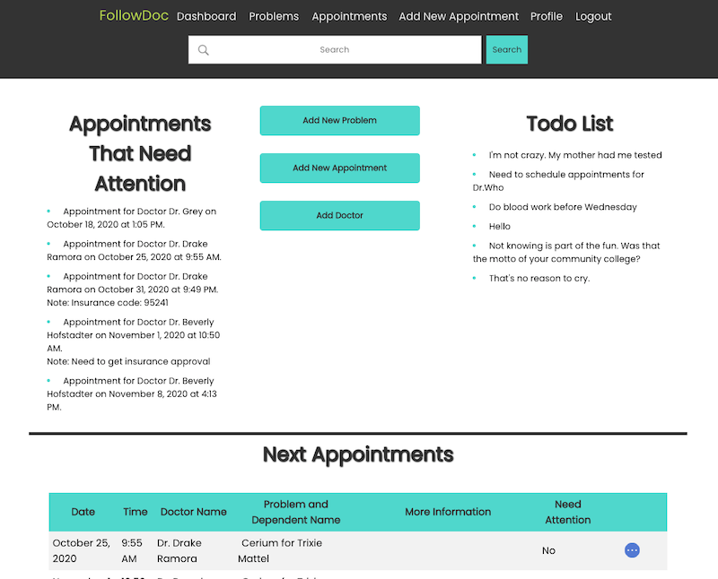

# Welcome to FollowDoc: Frontend

## Description:

Keep track of your and your family's medical issues and doctor appointments.
Create a list of follow-up items, add notes, and upload related docs.

You will also be able to keep a to-do list of all the ongoing items and have an organized list of your future and past appointments.

## Installations

- Fork and clone repository.
- Navigate into the directory where you cloned the repository.
- Install `yarn` with `yarn install` and then run `yarn start`.

## Features

- Users must be authorized to access the web application
    
  
- Users can add dependents and edit their names.

- Users can add problems to their dependents, with a short description. Users can add notes, appointments and files to the specific problem.

- Users can view the todo list and appointments list that needs preparation.   
  

- Users can search for a specific problem, appointment, or note.

- Users can view all appointments, sort by dependents, or filter to view only future appointments.
    
- Users can view a single appointment, see location on a map and add to the calendar.
- Users can archive their notes.   

## Build

- React/Redux
- HTML/CSS
- Ruby on Rails API
- AWS/Active Storage
- JWT/bcrypt

## Backend

https://github.com/cohenoa33/follow-doc-backend
